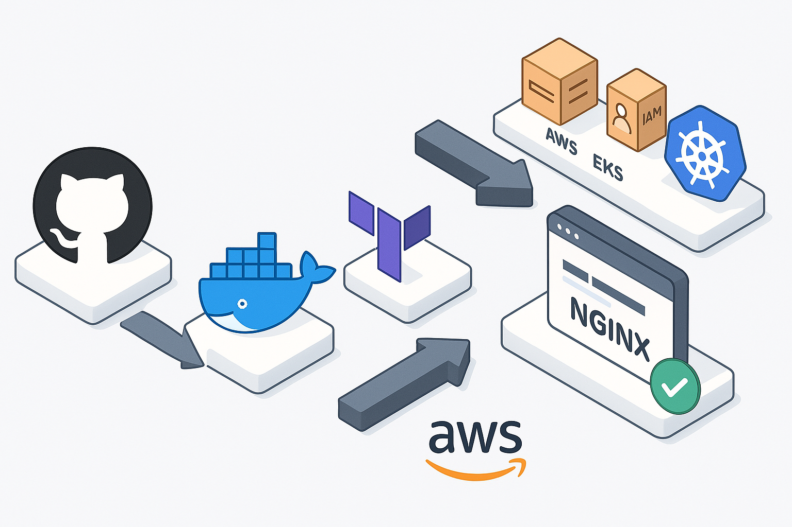

# TeraKube: Cloud-Native CI/CD Pipeline with EKS, Terraform, and GitHub Actions

## 🚀 Project Overview

TeraKube is a fully automated DevOps project that provisions a Kubernetes cluster on AWS using Terraform, containerizes an NGINX-based app with Docker, and deploys it seamlessly using GitHub Actions. The entire workflow is designed to be cost-efficient, scalable, and infrastructure-as-code compliant.

To maintain a clean development environment, we developed this project entirely within a Docker Ubuntu container on macOS, ensuring full isolation from the host system.

> Note: The live deployment step in the GitHub Actions workflow may show a failure after initial success because the EKS cluster and other AWS resources are deliberately destroyed using terraform destroy to minimize cost. This is expected behavior and not a pipeline issue.
* * *

## 🧰 Tech Stack

* **Terraform**: Infrastructure provisioning (VPC, EKS, Subnets, IAM)     
* **AWS EKS**: Kubernetes-managed cluster    
* **Docker**: Containerizing the app    
* **GitHub Actions**: CI/CD pipeline (build, push, deploy)    
* **Kubernetes**: App orchestration    
* **Docker Hub**: Container image hosting    
* * *

## 📁 Project Structure

```
TeraKube/
├── .github/workflows/deploy.yml       # CI/CD pipeline definition
├── terraform/                         # Modular IaC (vpc/, eks/)
├── k8s/                               # Kubernetes manifests (Deployment, Service)
│   ├── nginx-deployment.yaml
│   ├── nginx-service.yaml
│   └── index.html                     # Custom HTML for NGINX
├── Dockerfile                         # Base Dockerfile for local dev (optional)
├── app.Dockerfile                     # Dockerfile to build the NGINX app image
└── README.md                          # You're here!
```

<p align="center">
  
</p>

* * *
## 🌐 Infrastructure Provisioning with Terraform

We used Terraform to provision the following AWS resources:

* **VPC** with 2 public subnets    
* **EKS Cluster** with 1 managed node group (t3.small)
* IAM roles with minimum permissions    
* Public access to EKS control plane (for ease of use)    

> Run manually:

```bash
terraform init
terraform plan
terraform apply
```

> Tear down to minimize costs:

```bash
terraform destroy
```

* * *

## 🐳 Docker Image: NGINX App

We created a custom NGINX Docker image that serves a simple HTML file:

```dockerfile
FROM nginx:latest
COPY ./k8s/index.html /usr/share/nginx/html/index.html
```

This image is pushed to Docker Hub manually:

```bash
docker build -t sahith/terakube-nginx:latest -f app.Dockerfile .
docker push sahith/terakube-nginx:latest
```

* * *

## ⚙️ CI/CD with GitHub Actions

The GitHub Actions pipeline handles:

* Checking out code    
* Logging into Docker Hub    
* Building and pushing the image    
* Updating kubeconfig    
* Applying Kubernetes manifests to EKS    

**Trigger**: On push to `main`

**Workflow File**: `.github/workflows/deploy.yml`

* * *

## ☸️ Kubernetes Deployment

We deployed the app to EKS using the following YAMLs:

### nginx-deployment.yaml

* `nginx-deployment.yml`
* `nginx-service.yml`
> Test locally:

```bash
kubectl port-forward svc/nginx-service 8080:80
```

Open: `http://localhost:8080`

* * *

## 💰 Cost Optimization

* ✅ Used `t3.small` nodes (low cost)    
* ✅ Cluster destroyed after testing via `terraform destroy`    
* ✅ No LoadBalancer/Ingress used to avoid hourly AWS charges    

* * *

## 📊 Metrics

* 🕒 Full deploy from push to live: ~90 seconds    
* 🐳 Docker image size: ~30MB    
* ⚡ Cluster spin-up time: < 3 mins    
* 💸 AWS cost: $0 (Free Tier + short lifecycle)

* * *

## 🧪 Future Improvements

* Convert YAMLs to Helm charts    
* Add Ingress + TLS    
* Integrate Amazon ECR instead of Docker Hub    
* Add staging/prod environment pipelines    
* Experiment with GitOps and ArgoCD    

* * *

## 🙌 Special Thanks

Big thanks to the DevOps tools that made this easy: **Terraform | AWS | EKS | Docker | GitHub Actions | Kubernetes**

* * *

## 🔗 Links

* 🔗 [Docker Hub Image](https://hub.docker.com/r/sahithaitha02/terakube-nginx)    
* 🔗 [GitHub Actions Workflow](https://github.com/aithasahith02/TeraKube/actions/workflows/deploy.yml)
* 🔗 [Project Repo](https://github.com/aithasahith02/TeraKube)

### Thanks for reading!
